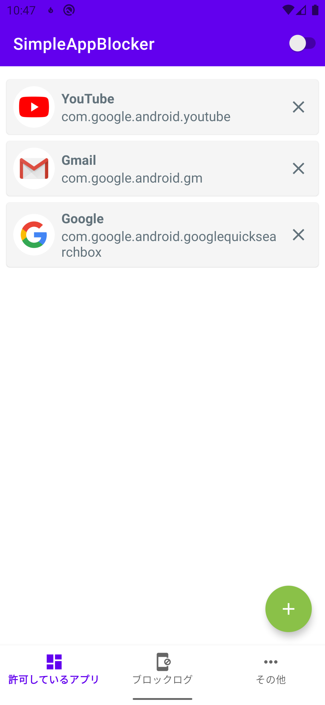
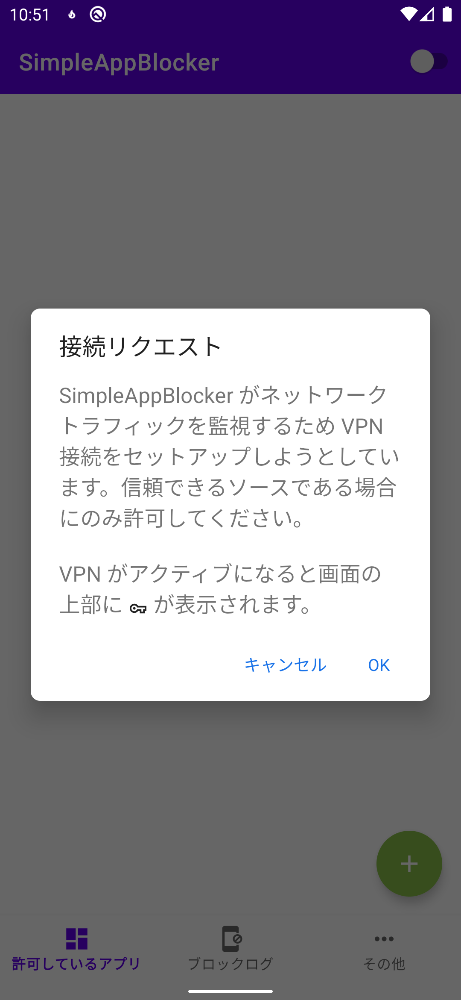
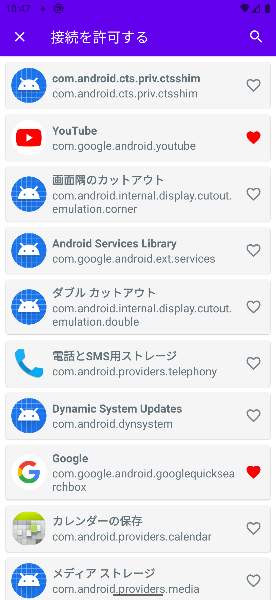
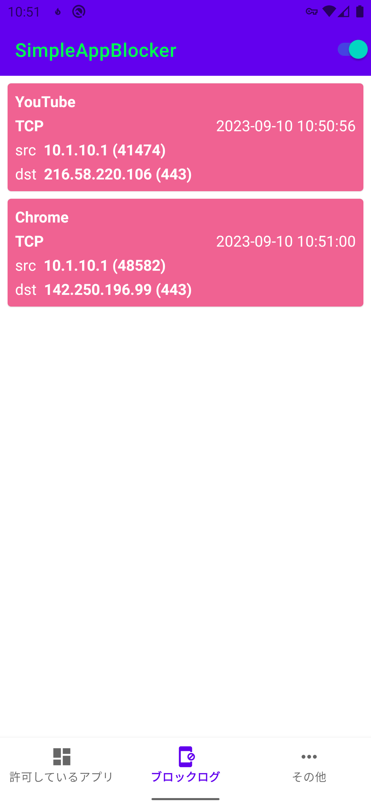

# Simple App Blocker

[](https://github.com/CASL0/simple_app_blocker/actions/workflows/unit_test.yml)
[](https://github.com/CASL0/simple_app_blocker/actions/workflows/check.yml)
[](https://app.codecov.io/github/CASL0/simple_app_blocker)
[](https://opensource.org/licenses/Apache-2.0)
[](https://android-arsenal.com/api?level=29)

[VpnService](https://developer.android.com/reference/android/net/VpnService) を利用し、指定のアプリ以外の通信をブロックするシンプルなユーティリティツールです。

端末にインストールされているアプリから、インターネットアクセスを許可したいアプリをシンプルな操作で選ぶことができます。また、ブロックしたインターネットアクセスのパケットの情報をリアルタイムで表示します。

<a href="https://play.google.com/store/apps/details?id=jp.co.casl0.android.simpleappblocker&pcampaignid=pcampaignidMKT-Other-global-all-co-prtnr-py-PartBadge-Mar2515-1"></a>

## スクリーンショット

<p>
  
  
  
  
</p>

## 機能

- ブロックした通信をリアルタイムで表示
- アプリ指定で通信許可
- IPv4/IPv6 対応
- ワンタッチでフィルタリングの有効/無効を切り替え

## 技術スタック

| カテゴリ | 技術 |
| --- | --- |
| 言語 | Kotlin, C++ |
| UI | Jetpack Compose, Material Design |
| アーキテクチャ | Clean Architecture, MVVM, 単方向データフロー (UDF) |
| DI | Hilt |
| データベース | Room |
| 非同期処理 | Kotlin Coroutines, Flow |
| ネイティブ | PcapPlusPlus (JNI), CMake |
| CI/CD | GitHub Actions, Fastlane |
| コード品質 | Spotless (ktfmt, clang-format), Android Lint, Kover |

## アーキテクチャ

Clean Architecture に基づくレイヤードアーキテクチャを採用している。詳細は [ARCHITECTURE.md](/docs/ARCHITECTURE.md) を参照。

### モジュール構成

```
app                        … ナビゲーション統合、エントリーポイント
├── feature/
│   ├── packet_filtering   … VPN サービスとパケットフィルタリング
│   ├── blocklog           … ブロックログのリアルタイム表示
│   ├── allowlist          … 通信許可アプリの管理
│   ├── rule_change        … フィルタリングルール設定
│   ├── update             … Google Play アプリ内アップデート
│   └── about              … アプリ情報、OSS ライセンス
└── core/
    ├── model              … ドメインデータクラス
    ├── data               … リポジトリ、データソース
    ├── database           … Room データベース、DAO
    ├── common             … Hilt 設定、共通ユーティリティ
    ├── ui                 … 共有 Compose コンポーネント
    └── pcapplusplus       … JNI バインディング (PcapPlusPlus)
```


## 動作要件

- Android 10 (API 29) 以上

## 開発する

### 前提条件

- Android Studio の最新版
- JDK 17

### セットアップ

```bash
# PcapPlusPlus ネイティブライブラリのダウンロード（初回必須）
./gradlew setup

# ビルド
./gradlew assembleDebug

# テスト
./gradlew test

# フォーマット適用
./gradlew spotlessApply
```

詳しくは [DEVELOPMENT.md](/docs/DEVELOPMENT.md) を参照。

## ドキュメント

[docs](/docs/README.md) を参照。

## ライセンス

```
Copyright 2022 CASL0

Licensed under the Apache License, Version 2.0 (the "License");
you may not use this file except in compliance with the License.
You may obtain a copy of the License at

    http://www.apache.org/licenses/LICENSE-2.0

Unless required by applicable law or agreed to in writing, software
distributed under the License is distributed on an "AS IS" BASIS,
WITHOUT WARRANTIES OR CONDITIONS OF ANY KIND, either express or implied.
See the License for the specific language governing permissions and
limitations under the License.
```
