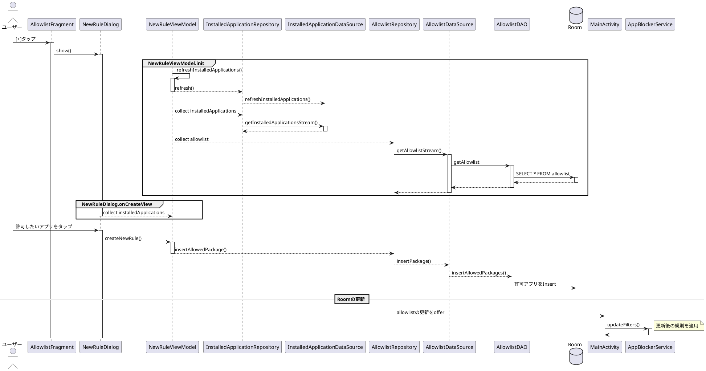
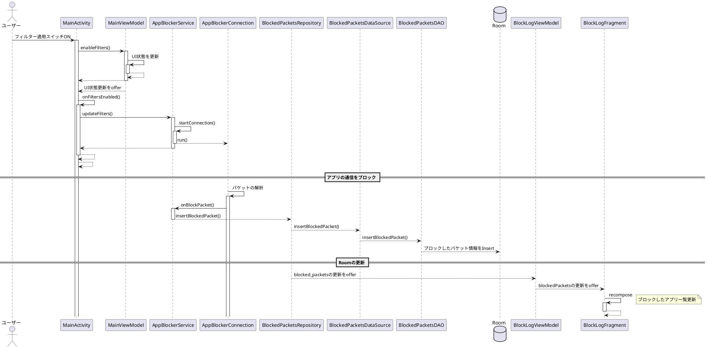

# Simple App Blocker シーケンス図

Simple App Blocker のシーケンス図です。

## 許可アプリ更新

```plantuml
@startuml
autoactivate on
actor ユーザー as user
participant AllowlistFragment
participant NewRuleDialog
participant NewRuleViewModel
participant InstalledApplicationRepository
participant InstalledApplicationDataSource
participant AllowlistRepository
participant AllowlistDataSource
participant AllowlistDAO
database Room
participant MainActivity
participant AppBlockerService

user -> AllowlistFragment : [+]タップ
AllowlistFragment -> NewRuleDialog : show()

group NewRuleViewModel.init
    NewRuleViewModel -> NewRuleViewModel : refreshInstalledApplications()
    NewRuleViewModel --> InstalledApplicationRepository : refresh()
    InstalledApplicationRepository --> InstalledApplicationDataSource : refreshInstalledApplications()
    NewRuleViewModel --> InstalledApplicationRepository : collect installedApplications
    InstalledApplicationRepository -> InstalledApplicationDataSource :  getInstalledApplicationsStream()
    return
    NewRuleViewModel --> AllowlistRepository : collect allowlist
    AllowlistRepository -> AllowlistDataSource : getAllowlistStream()
    AllowlistDataSource -> AllowlistDAO : getAllowlist
    AllowlistDAO -> Room : SELECT * FROM allowlist
    return
    return
    return
end

group NewRuleDialog.onCreateView
    NewRuleDialog --> NewRuleViewModel : collect installedApplications
end
user -> NewRuleDialog : 許可したいアプリをタップ
NewRuleDialog -> NewRuleViewModel : createNewRule()
NewRuleViewModel --> AllowlistRepository : insertAllowedPackage()
AllowlistRepository --> AllowlistDataSource : insertPackage()
AllowlistDataSource --> AllowlistDAO : insertAllowedPackages()
AllowlistDAO --> Room : 許可アプリをInsert

== Roomの更新 ==

AllowlistRepository --> MainActivity : allowlistの更新をoffer
MainActivity -> AppBlockerService : updateFilters()
note right : 更新後の規則を適用
return
@enduml
```

## アプリブロック

```plantuml
@startuml
autoactivate on
actor ユーザー as user
participant MainActivity
participant MainViewModel
participant AppBlockerService
participant AppBlockerConnection
participant BlockedPacketsRepository
participant BlockedPacketsDataSource
participant BlockedPacketsDAO
database Room
participant BlockLogViewModel
participant BlockLogFragment

user -> MainActivity : フィルター適用スイッチON
MainActivity -> MainViewModel : enableFilters()
MainViewModel -> MainViewModel : UI状態を更新
return
return
MainActivity <-- MainViewModel : UI状態更新をoffer
MainActivity -> MainActivity : onFiltersEnabled()
MainActivity -> AppBlockerService : updateFilters()
AppBlockerService -> AppBlockerService : startConnection()
AppBlockerService --> AppBlockerConnection : run()
return
return
return

== アプリの通信をブロック ==
AppBlockerConnection -> AppBlockerConnection : パケットの解析
AppBlockerService <- AppBlockerConnection : onBlockPacket()
AppBlockerService --> BlockedPacketsRepository : insertBlockedPacket()
BlockedPacketsRepository --> BlockedPacketsDataSource : insertBlockedPacket()
BlockedPacketsDataSource --> BlockedPacketsDAO : insertBlockedPacket()
BlockedPacketsDAO --> Room : ブロックしたパケット情報をInsert

== Roomの更新 ==
BlockedPacketsRepository --> BlockLogViewModel : blocked_packetsの更新をoffer
BlockLogViewModel --> BlockLogFragment : blockedPacketsの更新をoffer
BlockLogFragment -> BlockLogFragment : recompose
note right : ブロックしたアプリ一覧更新
return

@enduml
```
